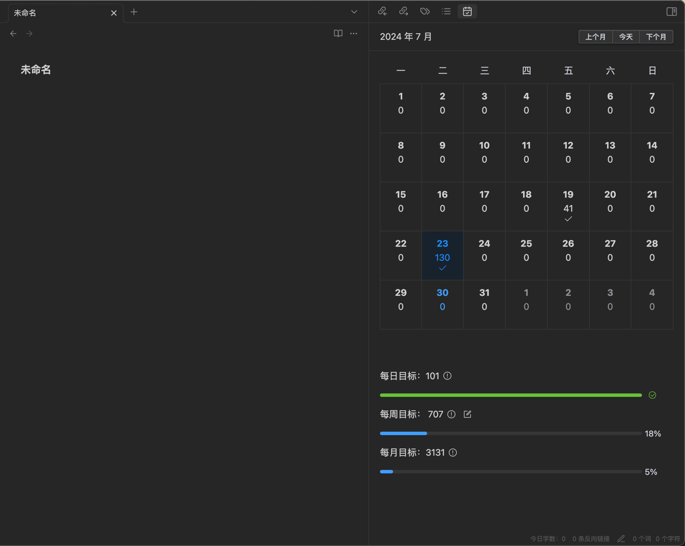

# Obsidian Daily Statistics

## 介绍
统计每日书写的字数，并展示在日历中。

## 功能
- [x] 统计每日字数
- [x] 指定需要统计的文件夹
- [x] 设置每周目标
- [x] 多语言配置：中文、英文
- [x] 不同的语言环境下，每周的开始时间不同
- [x] 鼠标双击日期，修改当日字数
- [x] 切换统计字符还是单词

## 其他

这个插件的许多功能参考了[obsidian-word-count](https://github.com/lukeleppan/better-word-count) 和 [obsidian-daily-stats](https://github.com/dhruvik7/obsidian-daily-stats)。

